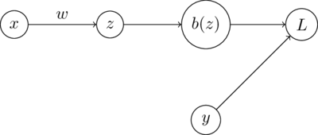

### Introduction

The perceptron learning algorithm is a parametric method for binary classification that is widely known as the precursor to neural networks.
The computation graph below shows how the model works.
The dot product of input $x$ and weight vector $w$ is taken and input into the binary step function $b(x)$.



    


### Learning

Given data set $X$ of size $N$ with $D$ dimensions, parameters $w$ are learned using the perceptron learning rule.
Because is almost always zero, the update rule is not defined in the way we defined the update for the logistic regression weight update rule.

$$
\begin{aligned}
    y &\in \{-1, 1\} \\
    %
    h(z) &= 
    \begin{cases} 
        1 & x \geq 0\\ 
        0 & x < 0 
    \end{cases} &
    \text{[Threshold function}]\\
    %
    w_i &=
    w_i + \alpha (y - h(z))x_i &
    \text{[Perceptron learning rule]}\\
\end{aligned}
$$

### Code

Code for a Perceptron classifier is shown in the block below


```python
from typing import List
from tqdm import trange
import torch


def BinaryStep(x: torch.Tensor) -> torch.Tensor:
    """ Apply binary step function to tensor

    Args:
        x: input tensor

    Returns:
        tensor with binary step function applied to all members
    """        

    x[x >= 0] = 1
    x[x < 0] = 0
    return x


def ErrorRate(y: torch.Tensor, yhat: torch.Tensor) -> float:
    """ Calculate error rate (1 - accuracy)

    Args:
        y: true labels
        yhat: predicted labels

    Returns:
        error rate
    """

    return torch.sum((y != yhat).float()) / y.shape[0]


class Perceptron:


    def __init__(self):
        """ Instantiate perceptron classifier
        """

        self.w = None
        self.calcError = ErrorRate


    def fit(self, x: torch.Tensor, y: torch.Tensor, alpha: float=0.001, epochs: int=100) -> None:
        """ Fit perceptron classifier to dataset

        Args:
            x: input data
            y: input labels
            alpha: alpha parameter for weight update
            epochs: number of epochs to train
        """

        self.w = torch.rand((1, x.shape[1]))

        epochs = trange(epochs, desc='Error')
        for epoch in epochs:
            for ridx in range(x.shape[0]):
                hz = self.predict(x[ridx][None, :])[0]
                dw = self.calcPerceptronUpdate(x[ridx][None, :], hz, y[ridx])
                self.w = self.w + alpha * dw

            ypred = self.predict(x)
            error = ErrorRate(y, ypred)
            epochs.set_description('Err: %.4f' % error)


    def predict(self, x: torch.Tensor):
        """ Predict labels

        Args:
            x: input data

        Returns:
            labels for each member of input
        """

        z = torch.einsum('ij,kj->i', x, self.w)
        hz = BinaryStep(z)[:, None]

        return hz


    def calcPerceptronUpdate(self, x: torch.Tensor, hx: torch.Tensor, y: torch.Tensor) -> torch.Tensor:
        """ Calculate perceptron update

        Args:
            x: input data
            y: input labels
            hx: predicted labels

        Returns:
            tensor of weight update values the same size as weights
        """

        return (y - hx) * x
```

### Resources

- Russell, Stuart J., et al. *Artificial Intelligence: A Modern Approach*. 3rd ed, Prentice Hall, 2010.
